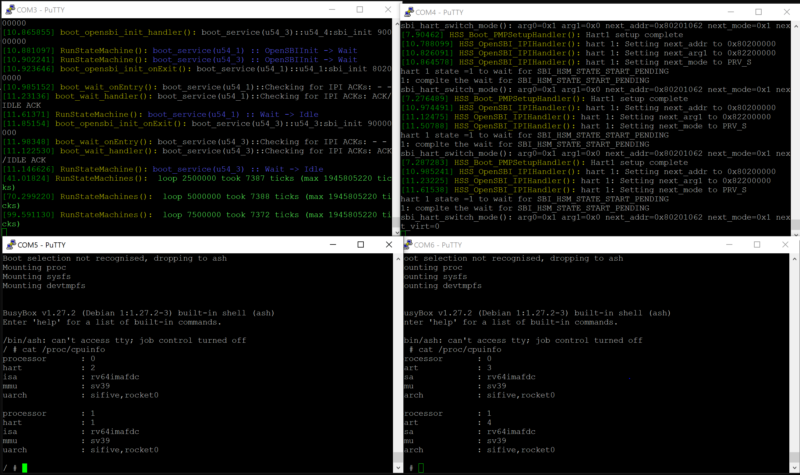

# Machine slice support
To simplify the workflow for slicing device tree and relocating kernel, we
removed U-boot from the booting workflow.

If you are interested in Hart Software Service, please refer to  [Hart Software
Service](README_base.md) for more information.

# Dependency
1. RISCV GCC toolkit
2. Latest qemu with microchip-polarfire support; Our tested version is
   [here](https://github.com/MSRSSP/qemu.git)
3. [Optional] If you want to run our examples, please build or download a RISCV
   kernel image and name it as `$(TOP)/linux/arch/riscv/boot/Image`. Our tested
kernel version is 5.13 from https://github.com/torvalds/linux.git. The latest
version should also work with our device trees.


# Build HSS and run examples using QEMU.
Before burning HSS to NVMe or write your image to MMC or SD card of your board,
you can also use Qemu to test them. However, the `microchip-icicle-kit` model
in qemu is slightly different from the latest board design. Thus, we added an
option `ENV=QEMU` in Makefile to set `CONFIG_QEMU=1` in code to bypass some
unsupported operations. 

## Build HSS:
   ```bash
   make BOARD=mpfs-icicle-kit-es defconfig
   make BOARD=mpfs-icicle-kit-es ENV=QEMU
   ```

# Build payload for HSS
  ```
  cd bypass-uboot
  make format DEVKIT=<EXAMPLE> 
  ```
  
| `EXAMPLE` | Example description |
| --- | --- |
| `EXAMPLE=single` | booting a single kernel in a 4-core machine |
| `EXAMPLE=slice` | booting one kernel at 0x80000000 using core 1-2 and another kernel at 0x9000000 using core 3-4|


# Build HSS and run examples using QEMU.
## Build HSS:
Build with `ENV=QEMU`.
```bash
make BOARD=mpfs-icicle-kit-es defconfig
make BOARD=mpfs-icicle-kit-es ENV=QEMU
```

## Build payload for HSS
```bash
cd bypass-uboot
make qemu EXAMPLE=${EXAMPLE} 
```
Upon a successful build, you should have a binary file
`build/${EXAMPLE}-payload.bin` and a 4G qemu raw image
`build/${EXAMPLE}-qemu-sd.img`.

## Run example `slice`
Launch qemu
```
./bypass-uboot/qemu.sh ./bypass-uboot/build/${EXAMPLE}-qemu-sd.img
```
The stdio in this terminal connects to serial 0. Now you can connect to serial
1,2,3 via `telnet` from other 3 terminals: 

```
telnet localhost 5431
telnet localhost 5432
telnet localhost 5433
```

## Troubleshoot

If you do not see any output from qemu, it is possible that your qemu's model
is different from the one we tested or you do not set ENV=QEMU when building
hss. The current QEMU model is different from the board, which is why we need
to comment out some boot procedures not supported by `qemu`. 

# Build HSS and run examples in a PolarFire Soc Icicle kit.
## Build HSS:
```bash
make BOARD=mpfs-icicle-kit-es defconfig
make BOARD=mpfs-icicle-kit-es
```

## Write HSS to NVMe via J33 port
Install
[`SoftConsole`](https://www.microsemi.com/product-directory/design-tools/4879-softconsole)
and open this directory in a project. Select `Run non-secure boot mode 1` to
write the HSS to your board.

## Write payload into a SD card
### Linux:
```bash
make format-payload EXAMPLE=${EXAMPLE}  DISK=/dev/sdX
```

### Windows:
In your WSL, run
```bash
make qemu EXAMPLE=${EXAMPLE}  
```
Open `Win32 Disk Manager`, write this SD image into the first disk for SD card.

## Run example `slice`

